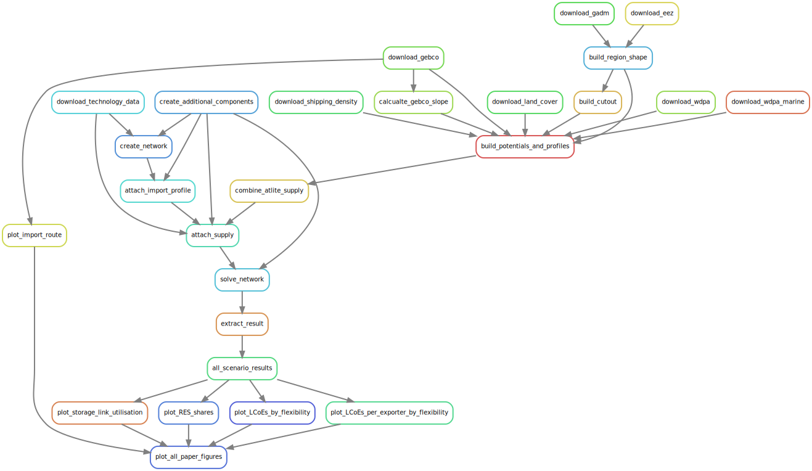

<!--
SPDX-FileCopyrightText: 2020-2021 Johannes Hampp
SPDX-License-Identifier: CC-BY-4.0
-->

[](https://results.pre-commit.ci/latest/github/euronion/trace/main) 
[](https://api.reuse.software/info/github.com/euronion/trace/)
[](https://snakemake.readthedocs.io)
[](https://github.com/psf/black)

# TRACE - Transporting Renewables as Chemical Energy - paper branch

## Reproducing study results (install & run instructions)

To reproduce the study results you need:

* an up-to-date Python installation with the `conda` or `mamba` package manager installed
* 
* an Gurobi solver license setup for your machine (for optimisation)

Then follow these instructions:

1. Install the necessary packages by creating a dedicated environment:
   ```
   mamba env create -f envs/environment.yaml
   ```
   Note: The results were created using the packages and versions from `envs/environment.used.yaml` which may be installed instead.
2. Activate the new environment:
   ```
   conda activate trace
   ```
3. Run `snakemake`
   ```
   snakemake -call plot_all_paper_figures
   ```

   This operation may take a long time, depending on your internet connection (downloading) and computer resources (optimisation). The operation will download a lot of files, then create all scenario's PyPSA networks and run the optimisation on them. Finally, it will create all figures presented in the paper and the `.csv` files containing results.
4. Results can then be found here:
   * `results/results.csv`: Major results for all scenarios, may be opened using e.g. LibreOffice Calc or MS Excel
   * `figures/`: Figures presented in the paper are automatically created

The results are automatically created using [`snakemake`](snakemake.readthedocs.io/) in the background as workflow management software. It runs the following steps in the correct order:


Some of the rules are executed for each scenario which is not shown to keep the figures simple. The figure can be recreated using `snakemake -call plot_rulegraph`.

## Files and folders

The following files and folders are contained or later created in your `trace` directory:

```
$ tree -L 1
.
├── actions     # Scripts for building and solving the model
├── config      # Input configuration for model and scenarios
├── data        # Input data for the model
├── envs        # Python environment definitions
├── escs        # ESC definitions; blueprints for building the PyPSA models
|               # The blueprints contain technologies and how they are linked together
├── figures     # (created automatically) Figures used in the paper based on results
├── LICENSES    # License files for all licenses used in this repository
├── logs        # (created automatically) log files for each execute rule
├── README.md   # You are reading this
├── resources   # (created automatically) intermediary files
├── results     # (created automatically) Result files for each scenario/year/ESC/exporter-importer;
│               # Contains the optimised PyPSA networks and a CSV file with prominent results
├── rules       # Snakemake rule directory containing the workflow definitino for the model
└── Snakefile   # Snakemake file orchestrating the workflow
```

## Original documentation

The following sections are from the original documentation and give an overview on how the model and repository works. These sections were written for a different publication and may not all apply to this publication.

Original publication for which this documentation was written:

```
    @article{hampp2021import,
      title={Import options for chemical energy carriers from renewable sources to Germany}, 
      author={Johannes Hampp and Michael Düren and Tom Brown},
      year={2021},
      eprint={2107.01092},
      archivePrefix={arXiv},
      primaryClass={physics.soc-ph},
      url={https://arxiv.org/abs/2107.01092}
}
```

### Solving a scenario

Solving a scenario (i.e. set of assumptions like e.g. WACC, domestic demand, exporting/importing countries) use the snakemake
command

```
    snakemake -jall results/<scenario>/results.csv
```

were `<scenario>` is the name of the scenario listed under `scenarios` in `config.yaml`, e.g. `default` or `lowhomogeneous`.
The command executes the necessary steps, solves the network(s) for all combinations of ESCs, exporting and importing countries,
extracts the results and merges the main results into a single `results/<scenario>/results.csv` file for manual or automatic
result analysis.

In some cases scripts in the snakemake workflow can fail if too many rules are started simultaneously (an issue with jupyter notebooks)
or memory consumption during solving exceeds the memory snakemake allocated to the solving process.
To avoid these cases it is recommended to use the `--restart-times <N>` flag for `snakemake`, which
automatically tries to re-run single failed rules `<N>` times and increases the allocated memory for the solving rules
each time it fails (a brute force approach, but simple and it has proven to be reliable).

E.g. for obtaining results for the scenario `default` run:

```
    snakemake -jall --restart-times 3 results/default/results.csv
```

Similarly a single country-year-ESC combination may be solved for a single scenario, e.g.:
```
    snakemake -jall --restart-times 3 results/default/2030/hvdc/ES-DE/results.csv
```
will produce two files in the directory, one is the `results.csv` file with extracted results
from the solved network, which is stored as a PyPSA network as `network.nc` side-by-side to the
`results.csv` file.

### Running a sensitivity analysis / parameter sweep

For sensitivity analysis and parameter sweeps, scenarios with modified input parameters are used.
All currently implemented modifiers are listed in the `default` scenario in `config.yaml` with their default values.
Defining a new scenario in the `config.yaml` and overwriting the desired modifiers allows for conducting a sensitivity analysis.
Each scenario is solved separately as a stand-alone scenario as described above, e.g. scenario `sensitivity-1`:

```
    snakemake -jall --restart-times 3 results/sensitivity-1/results.csv
```

The results can then be combined and compared against the 'default' scenario to obtain the sensitivities.

### Defining ESCs

ESCs are defined in the `esc` subfolder as PyPSA networks.
For each ESC, its specific subfolder is parsed and converted into a region-specific PyPSA network representing the ESC.
Following files corresponding to PyPSA components are used for described purposes:

* 'loads.csv' : for implementing demand
    + Demand is implemented with a constant load (hourly average = annual total / 8760)
    + A store component (see later) is connected with losless links and without capital costs of arbitrary capacity
      to remove any influence by the time-dependency of the demand.
      With this approach the annual delivered energy becomes relevant, rather than satisfying the hourly demand in time.
      By convention, this store located on the import side and is named "buffer", is assigned with capital_cost=0.1 (to avoid numeric shennanigans).
* 'buses.csv' : basic building blocks to which all else attaches
    + buses represent different states of energy carriers or chemicals, e.g. CH4 (g), CH4 (l), CH4 compressed or water.
    + units of the buses are used for consitency checks and scaling costs/efficiencies in the model
    + by convention were energy is relevant, the bus carriers a power unit (preferrably MW); otherwise the bus uses m^3 or t (NOT m^3/h or t/h)
    + additional buses and links may be created to match the units in the costs input
    (e.g. converting t to m^3 for methanol storage, rather than changing the unit in the cost database)
* 'stores.csv' : Storing energy carriers or chemicals
* 'links.csv' : Converting between energy carriers, chemicals
    + Conversion defined via the 'data/efficiencies.csv' file
    + names of the links and connected buses must match to the efficiencies, except for a trailing (exp) or (imp)
    + names of the links and units of their bus0 or bus1 must match the names in the cost database, except for trailing (exp) or (imp) and different si prefixes for units
    + most buses are unidirectional with bus0 as input and bus1 as output; bus2, bus3 can be additional inputs
    + some buses are bidirectional with bus0 and bus 1 as input and output; bus2, bus3 not implemented for these types of links
    + special column 'scale_costs_based_on': This is an extension on the csv file. It specifies to which bus/energy carrier the 
        costs for this link in the cost data refers to. Values of this column are either 'bus0','bus1' or 'n/a' if no cost entry for this
        link exists because it is irrelevant.
* 'ships.csv' : Own extension for shipping based on PyPSA components
    + Contains properties of different types of ships
    + Data there must match the ship types in the cost database
    + for more details, see the 'Special case: Shipping' below
* Naming conventions
    + Trailing "(exp)" or "(imp)" are ignored during building of the network in bus/link/store names)
    + Also ignored are leading descriptors in the same braket, e.g. "(charging, exp)" or "(What do you hear?, imp")
    + Use "(exp)" and "(imp)" in names to indicate were a component is located - on the exporter or importer side of the model
* Costs
    + data taken from customised `technology-data` repository (CAPEX, FOM, lifetime)
    + capital costs p.a. are calculated using EAC
    + WACC assumptions in `config.yaml`
    + cost data is loaded during network creation (`actions/create_network.py.ipynb`)
    + adjustments to cost data (where necessary) are made right after network creation (`actions/create_network.py.ipynb`). The following adjustments are made:
        - Battery inverter cost: halfed; cost is for bidirectional inverter, model deploys two inverters with same power rating (enforced by constrained), thus doubling the cost for inverters
        - transmission distances: between regions are considered based on `data/distances.csv` and link capital costs per distance are scaled with the distance.

### Special case: Shipping
        - Shipping is special as it is a non-continuous transportation method
        - Shipping connections are defined with the non-standard PyPSA `ships.csv` in the respecitve ESC
        - `ships.csv` is read by `create_network.py.ipynb` and then translated into comparable PyPSA compoenents
        - Internally a ship is represented by a link for loading, a link for unloading and a link for representing energy loss during the journey and a store (cargo hold).
            The energy loss during the journey is either the energy required for propulsion or boil-off, whatever is larger.
            The idea is that boil-off may be used for propulsion as well and propulsion energy is always provided by the ship's cargo.
        - A delivery schedule is exogeneously provided, letting the loading and unloading links work with fixed delay representing the loading/unloading process and
            the travel time inbetween.
        - Instead of a ship with a fixed maximum capacity we think of it more as a group of ships = convoy which all travel together without an upper limit on capacity.
        - Additionally a constraint added in `solve_network.py.ipynb` for the solver ensures that for each convoy the annual loaded and unloaded amounts are equal.
        - For each shipping connection, multiple convoys are added such that all possible combinations are accounted for.
            In these combinations, the convoys can not load or unload while another convoy is loading/unloading.
        - The convoys are scheduled such that a as-constant-as-possible supply may be build by the model, i.e. a convoy arrives always shortly after the previous
            convoy left.
        - Travel time may be artificially increased to achieve a more constant supply by ship and avoid longer periods were not shipment arrives
            at the end of the year. The increase should be negiglible and in the range of a few hours per trip and is also logged for each scenario.
        - Additionally convoys may arrive a few hours later to fill gaps in the scheduling (again to smoothen the supply)
        - The model is provided with the investment costs per amount of cargo deliverd and may freely choose the amount to transport during for each shippment in each shipping "lane"
        - Limitation of the exogeneous scheduling:
          At the beginning of each scenario year there might be a larger supply gap of a few hours/days, where no ship arrives due to unfavourable combinations of
            journey time and loading/unloading duration
            
### LOHC

For LOHC transport the chemical costs also have to be taken into account.
This is hard-coded into the model in `actions/create_network.py.ipynb` in the method `override_costs_for_special_cases(n)`.
The following assumptions are made:
* DBT is used as LOHC
* Chemical costs are stored in cost database as 'LOHC chemical' in EUR/t
* The LOHC / H2 ratio is taken from efficiencies.csv , "LOHC hydrogenation"

The hard-coding modifies the following costs:
* The generators for LOHC chemicals: capital_costs become marginal_costs (per t of LOHC additionally required in the model to compensate losses)
* LOHC shipping lanes have an additional store for keeping track and transporting used, unloaded LOHC chemical

### Conventions

* Chemicals are specified with their lower heating value (LHV) and use of LHV at this point is indicated
* Other input chemicals like water or CO2 are specified by their weight (t)
* bus units always represent a rate, i.e. "t/h" or "MW"
* The demand of the importing region is specified in `<esc>/loads.csv` in MWh/h, conversion table for hydrogen:

| energy carrier | hourly amount [t] | annual amount [t] | hourly amount [MWh] |annual amount [TWh] | HV assumed |
|----------------|-------------------|-------------------|---------------------|--------------------|------------|
| H2             | 410.96            | 3.6e6             | 13 698.65           | 120                | LHV        |

* "bus0" for links is always the input for which the cost.csv data is defined (preferred: electricity)
* "bus1" for links is always the output of the link
* RES are always attached to the bus "electricity (exp)" (in attach_supply.py.ipynb). This bus name must therefore exist in each ESC.
* In leap years (e.g. 2040) the leap day is ignored by dropping the 29th of February when encountered (= 365 days for all years)

### Supply

* Supply time-series are synthetically generated (hourly curves, one representative year) using Global Energy GIS
* Config for creating supply via `config.yaml`
* Supply is attached to networks via `actions/attach_supply.py.ipynb`
    1. LCoE for all different supply quality classes is determined
    2. Domestic demand is compared to LCoEs
    3. RES with lowest LCoE are reserved for domestic demand, such that the annual production from the RES classes matches the domestic demand.
    (no additional electricity demand or storage losses are assumed for satisfying the domestic electricity demand and no hourly profile,
    only the annual demand/supply).
    4. Residual RES are then attached to the network as PyPSA generators.
    
### Solving

By default the commercial solver Gurobi is used.
Free academic licenses are available.
We use the 'barrier' solving algorithm and skip the crossover, 
as the additional accuracy from crossover is negligible for our problem.
We also make use of the "PreDual = 2" option from Gurobi,
which showed to dramatically increase solver speed for all ESCs involving long distance shipping.

As a fallback method the model automatically switches back to the default gurobi solver methods and
retries solving the scenario again.

### Paper and citing

This model is currently under peer-review.
A preprint for this model is available on arXiv:

```
    @misc{hampp2021import,
      title={Import options for chemical energy carriers from renewable sources to Germany}, 
      author={Johannes Hampp and Michael Düren and Tom Brown},
      year={2021},
      eprint={2107.01092},
      archivePrefix={arXiv},
      primaryClass={physics.soc-ph},
      url={https://arxiv.org/abs/2107.01092}
}
```

This software is archived in Zenodo.
A permanent record of the most recent release version can be found here: [](https://zenodo.org/badge/latestdoi/317544698) .

### License

* Model code: [GPLv3-or-later](LICENSES/GPL-3.0-or-later.txt)
* Data: [CC-BY-4.0](LICENSES/CC-BY-4.0.txt)
* Misc: [CC0](LICENSES/CC0-1.0.txt)

The license under which a files is licensed is usually indicated in the beginning of the individual files.
For some files the license is stated in the [dep5 file](.reuse/dep5).
